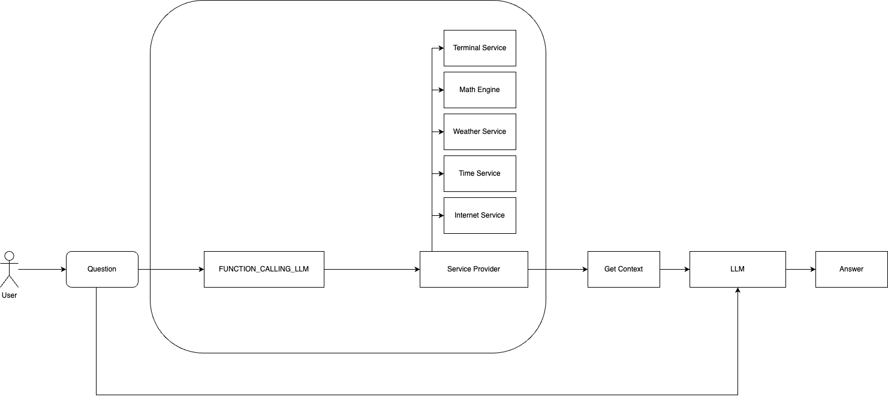
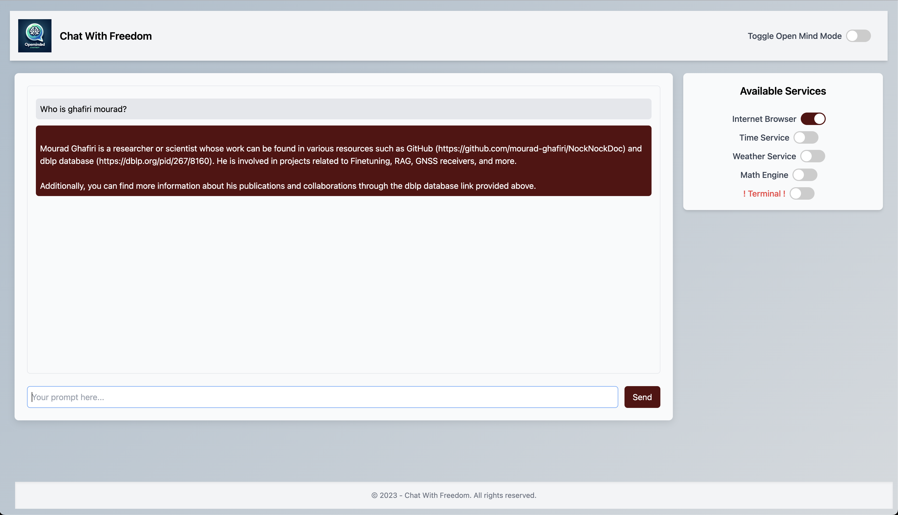
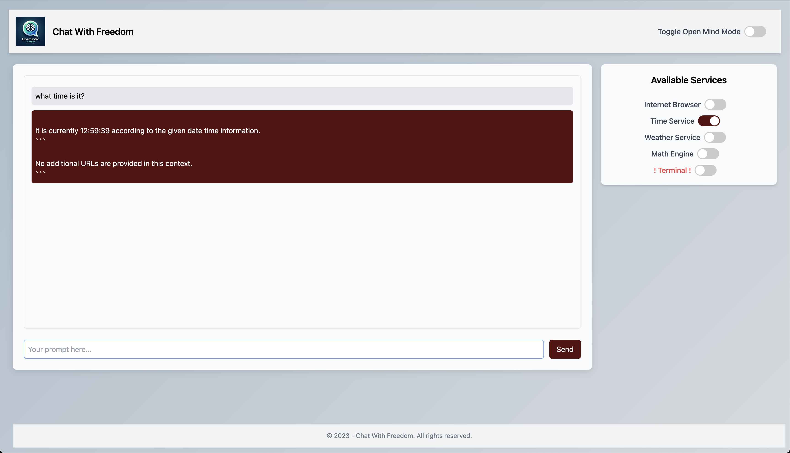
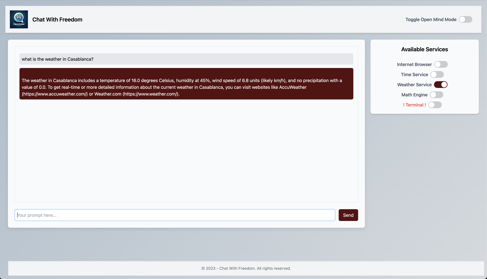
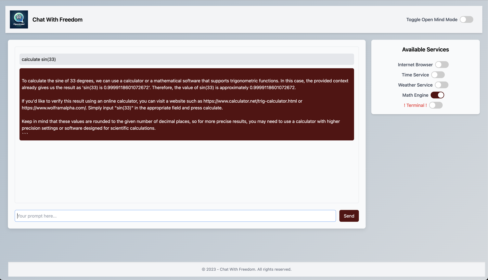
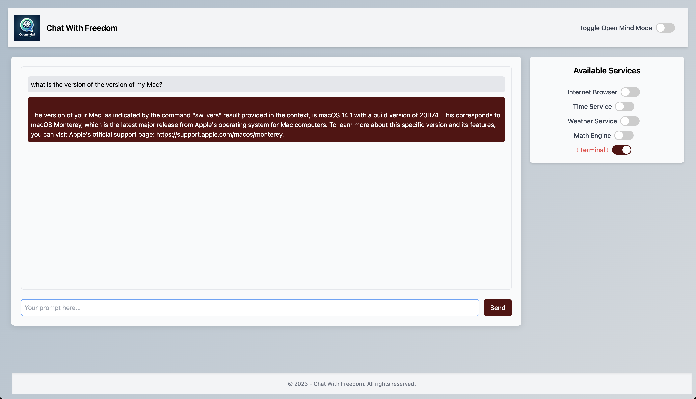

# OpenMindedChatbot

## Overview

OpenMindedChatbot is a Proof Of Concept that leverages the power of Open source Large Language Models (LLM) with Function Calling capabilities to provide comprehensive and flexible responses to user queries. It operates in two modes: a standard mode for general queries and an 'Open Minded' mode that allows for more unrestricted and creative responses.

## Features

- **Dual Mode Operation**: Choose between 'Normal' and 'Open Minded' modes to tailor the chatbot's responses to your needs.
- **Function as a Service**: OpenMindedChatbot incorporates several service functions, including:
  1. **Internet Browsing Service**: Utilizes DuckDuckGo for efficient web scraping.
  2. **Weather Service**: Provides current weather updates.
  3. **Time Service**: Offers accurate time information.
  4. **Math Engine**: Solves complex mathematical problems.
  5. **Terminal Service**: Access your terminal directly through the chatbot. (Note: Use this service with caution as it will utilize your local terminal.)

## Architecture



## Application Screenshots








## Models

OpenMindedChatbot uses the following models for its operations:

- **LLM**: TheBloke/Marcoroni-7B-v3-GGUF/marcoroni-7b-v3.Q8_0.gguf
- **Function Calling**: TheBloke/NexusRaven-V2-13B-GGUF/nexusraven-v2-13b.Q5_0.gguf

Users can change these models in the `src/configs/config` file. The GGUF files for these models can be downloaded via LM Studio or Hugging Face.

## Dependencies

- llama-cpp-python
- fastapi
- uvicorn
- websockets
- python-multipart
- requests
- bs4

## Installation

1. Install dependencies:

    ```bash
    pip install -r requirements.txt
    ```

2. Run the application:

    ```bash
    uvicorn main:app
    ```

3. Navigate to `http://127.0.0.1:8000` in your web browser.

## Enjoy OpenMindedChatbot

Experience the flexibility and power of OpenMindedChatbot in answering a wide range of questions and performing various tasks. Enjoy exploring its capabilities!
